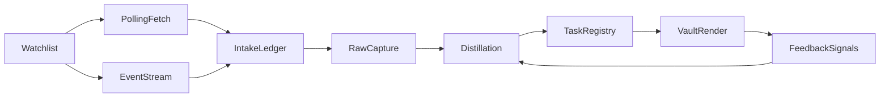

# Lark-to-Notes Workflow Plan

This document is the current requirements and implementation-guidance file for the local Lark-to-notes workflow. It captures the scope, defaults, architecture, rationale, risks, and phased execution guidance, and it should stay aligned with implementation decisions as the project moves from planning into execution.

## Problem

Important work and context arrive through Lark in multiple forms:

- direct messages
- group chats
- documents
- document comments

That content may be in English, Chinese, or mixed-language form.

Without a structured workflow, useful context remains trapped in Lark or is copied manually into notes with inconsistent quality and incomplete follow-through. The project should provide a reliable path from Lark into the notes vault so that raw context can become actionable items and durable knowledge.

The workflow must do more than ingest content. It must also be trustworthy under retries, source edits, mixed polling plus event-driven updates, human edits inside the vault, and uneven source volume. A system that captures many items but creates duplicates, loses provenance, or overwrites user notes will quickly lose trust.

## Goals

### Key Objectives

1. Reduce manual effort in turning Lark content into useful notes.
2. Capture important work items from DMs, groups, documents, and comments.
3. Maintain a durable open-task view instead of leaving action items scattered across conversations.
4. Accumulate durable knowledge in the notes vault over time.
5. Improve workflow quality continuously through human feedback on the generated outputs.
6. Make automation trustworthy through provenance, safe note updates, and idempotent sync behavior.

### Expected Benefits

1. Faster context capture.
2. Fewer neglected work items.
3. Better continuity between communication tools and durable notes.
4. Lower repeated triage effort.
5. Controlled LLM usage and lower long-term model cost.
6. Clear traceability from each surfaced task back to its source.
7. Safe reruns, recovery, and reprocessing without duplicate note churn.

### Operating Preferences

1. The system should prefer some false positives over false negatives because neglecting work items is costlier than later cleanup.
2. The system should automatically update machine-owned note sections by default.
3. The system must not overwrite user-authored content outside machine-owned sections.
4. For the initial version, task completion can remain a manual user action.
5. Polling every five minutes is acceptable for non-urgent sources.
6. Event-driven updates should usually propagate within a couple of seconds where technically available.
7. Watched sources should be explicitly configured and pausable.
8. Deterministic processing should handle most inputs. LLM use should be reserved for uncertainty, summarization, or multilingual disambiguation that meaningfully improves output quality.

### Implementation Defaults

The following defaults should be treated as implementation decisions for v1 unless later evidence forces a change:

1. watched sources default to explicit allowlists rather than broad discovery
2. SQLite is the single local system of record for pipeline state
3. one active provider policy is used at a time; v1 does not use multi-model blending
4. task completion remains manual
5. one serialized note writer owns all vault mutations
6. plannotator remains the first review UI, with machine-parseable feedback stored in a YAML sidecar by default
7. deterministic heuristics remain the default classifier, with selective LLM escalation only for uncertain or long-context cases
8. the existing `automation/lark_worker/` MVP is a non-normative reference only; the actual implementation may differ materially if it better satisfies this document

## Environment

### Access and Tooling

1. Access to Lark content is through `lark-cli`.
2. `lark-cli` uses Lark app credentials to call the underlying Lark APIs.
3. Source access, permissions, and visibility are therefore constrained by the configured Lark app and its credentials.
4. Retrieval paths and payload fidelity may differ by source class and should be validated during implementation.

### Source Surfaces

1. In-scope sources are:
   - direct messages
   - group chats
   - Lark documents
   - comments on Lark documents
   - comment replies on watched documents when accessible
2. Documents, document comments, and comment replies should be treated as the same high-level source class for this project, but they should remain distinct record types internally.
3. The user may identify relevant documents by link or by name.
4. An initial watched-document example is:
   - `https://gotocompany.sg.larksuite.com/docx/D5IXd2EQLoZ3yvxY1WBlJi71gmf`
5. Watched sources should be modeled as explicit allowlists with optional ignore rules, pause/resume controls, and configurable backfill windows.

### Content Characteristics

1. Source content may be English, Chinese, or mixed-language.
2. Task-bearing signals may be expressed by configurable phrasing and patterns such as:
   - `?`
   - `need`
   - `需要`
   - `帮忙`
   - `看下`
   - `看看`
3. These patterns should remain configurable rather than hard-coded as the final truth.
4. Useful task signals may also come from assignee cues, due-date cues, question forms, urgency markers, or repeated follow-up language.
5. Documents, comments, and replies are mutable. They may be edited or deleted after first capture and should therefore be treated as revision-bearing records rather than static text blobs.

### Vault Contract

1. New source material should land in `raw/` first.
2. Distilled action items should land in the relevant `daily/YYYY-MM-DD.md` first.
3. Still-open work should be promoted into `area/current tasks/index.md`.
4. Durable context should roll into `people/`, `projects/`, and `area/` notes only when it is more than a one-off item.
5. Source notes and curated notes should cross-link with Obsidian wikilinks.
6. Automation should prefer updating existing canonical notes over creating near-duplicates.
7. Automation must preserve user-authored content and only update machine-owned blocks.
8. SQLite raw capture remains the durable system of record for replay, reconciliation, and reclassification.
9. `raw/` contains vault-visible raw notes or context artifacts derived from that raw store; "raw first" refers to vault rendering order, not to bypassing the database-backed raw capture layer.

### User Interface Environment

1. The current task view is a Markdown file rendered in Obsidian.
2. The initial feedback surface should use plannotator on Markdown artifacts.
3. Markdown and Obsidian remain the current operating UI for the notes vault.
4. A separate frontend can be considered later if plannotator-based feedback becomes too limiting.

### LLM Environment

1. The current model provider is Copilot through an enterprise account.
2. Other providers may be used in the future.
3. Provider limits and pricing affect how aggressively LLM calls can be used.
4. The actual Copilot request-count and pricing-related constraints should be confirmed.
5. The design should tolerate a heuristics-only mode when budgets or provider access are unavailable.

## Recommended Tech Stack

### V1 Recommendation

1. Start with a Python-only implementation for the first version.
2. Use Python for the runtime, CLI, sync workers, storage access, note rendering, feedback processing, and reconciliation logic.
3. Do not introduce Rust in the first version.
4. Do not build a dedicated frontend in the first version unless Markdown and plannotator prove clearly insufficient.

### Why Python First

1. The hardest parts of the system are sync correctness, idempotency, replay, revision handling, task heuristics, and safe note writes rather than CPU-bound computation.
2. End-to-end latency is more likely to be dominated by `lark-cli`, Lark API access, LLM calls, and disk I/O than by local compute.
3. Python is a strong fit for local automation, text-heavy workflows, Markdown generation, LLM orchestration, and SQLite-backed pipelines.
4. Python will allow faster iteration on heuristics, feedback loops, and note-rendering behavior while the workflow is still evolving.

### Core Stack

1. Language: Python 3.12 or newer.
2. Environment and dependency management: `uv`.
3. Storage: SQLite as the local durable store for the intake ledger, per-source cursors, raw capture metadata, task registry, feedback signals, and run history.
4. CLI: `typer`.
5. Schema and config validation: `pydantic`.
6. Persistence layer: a thin SQLite repository layer or `sqlalchemy` if the model grows enough to justify it.
7. HTTP and process integration: `httpx` plus Python subprocess support for `lark-cli`.
8. Retry handling: `tenacity`.
9. Logging: structured logging through `structlog` or disciplined standard-library logging.
10. Testing: `pytest`.
11. Linting and formatting: `ruff`.
12. Type checking: `mypy`.
13. Markdown and frontmatter handling: focused Python libraries such as `python-frontmatter` and a Markdown parser only where structured edits are needed.

### Suggested Repository Structure

1. `pyproject.toml` for dependencies, tooling, and project metadata managed through `uv`.
2. `src/lark_to_notes/` as the main Python package.
3. `src/lark_to_notes/config/` for settings models, source governance rules, and provider configuration.
4. `src/lark_to_notes/intake/` for `lark-cli` integration, polling, event intake, cursor handling, and the intake ledger.
5. `src/lark_to_notes/storage/` for SQLite schema management, repositories, and persistence helpers.
6. `src/lark_to_notes/distill/` for heuristics, optional LLM routing, classification, and task generation.
7. `src/lark_to_notes/tasks/` for task identity, fingerprinting, merge rules, lifecycle state, and promotion logic.
8. `src/lark_to_notes/render/` for raw-note creation, daily-note updates, Current Tasks updates, and machine-owned block rendering.
9. `src/lark_to_notes/feedback/` for parsing structured triage actions, feedback artifacts, and tuning inputs.
10. `src/lark_to_notes/runtime/` for workers, retry policy, reconciliation, scheduling, locking, and health checks.
11. `src/lark_to_notes/cli/` for `typer` entrypoints such as sync, replay, reconcile, and backfill commands.
12. `tests/` for unit, integration, and replay/idempotency tests.
13. `scripts/` only for lightweight developer utilities that do not belong in the main package.
14. `var/` or another local-only ignored directory for SQLite files, run logs, caches, and temporary artifacts produced at runtime.

### Architecture Guidance

1. Keep the Python runtime as the source of truth for intake, replay, task generation, note writing, and reconciliation.
2. Use SQLite-backed state instead of adding external infrastructure such as Redis or a separate queue for the first version.
3. Prefer a clean module boundary between ingestion, normalization, raw capture, distillation, task registry, feedback ingestion, and vault rendering.
4. Design the runtime so that future UI layers can call into it through a stable local API, CLI contract, or shared database schema.

### Future Evolution

1. Add a TypeScript frontend later only if the workflow outgrows Markdown, Obsidian, and plannotator.
2. Introduce Rust only after profiling shows a real hotspot such as large-document diffing, indexing, or high-volume replay.
3. If a later dedicated UI is built, prefer a Python runtime with a TypeScript frontend rather than splitting core workflow logic across multiple languages too early.

## Project

### Scope

The project is to build a local workflow that:

1. ingests selected Lark DMs, groups, documents, and document comments
2. normalizes captured items into stable internal records
3. stores raw source material durably with revision history
4. distills raw context into candidate action items and note content
5. writes notes automatically into the vault according to the vault contract
6. maintains a durable Current Tasks view
7. supports structured feedback, replay, and reprocessing
8. provides runtime, observability, reconciliation, and cost controls for daily use

### Out of Scope

1. Replacing Lark as the system of record for communication.
2. Building an outbound reply or action layer for now.
3. Requiring an LLM call for every input item.
4. Treating manual note editing as obsolete.
5. Automatically deciding that tasks are complete in the initial version.
6. Building a custom frontend before Markdown and plannotator prove insufficient.

### V1 Execution Slice

The first implementation should ship a coherent slice rather than try to complete every future-facing idea at once.

1. V1 should cover watched-source governance, raw capture, replay, heuristics-first distillation, a visible `needs-review` lane, safe daily-note plus Current Tasks rendering, and structured feedback import.
2. Automatic durable-note updates beyond `raw/`, daily notes, and Current Tasks should start as opt-in or later-phase work after note safety and task identity are stable.
3. A single local runtime with SQLite and a serialized note writer is sufficient for v1; queues, extra processes, or more elaborate concurrency models are implementation details rather than baseline requirements.
4. The initial implementation should favor a minimal end-to-end loop over broad surface-area completeness.
5. The current `automation/lark_worker/` MVP may inform naming or operational lessons, but it is not the target architecture.

### Main Workstreams

1. source governance and intake
2. raw storage, checkpoints, and replay
3. lifecycle modeling for mutable sources
4. classification and action-item generation
5. task identity and deduplication
6. note rendering and vault-safe writes
7. feedback collection and quality improvement
8. runtime, reconciliation, and operations
9. performance, batching, and cost control

### Main Milestones

1. requirements and governance baseline approved
2. source model and ingestion contract approved
3. raw-capture and replay model approved
4. task-identity and generation model approved
5. note-rendering and vault-safety model approved
6. runtime, observability, and reconciliation model approved
7. feedback and cost-control model approved
8. execution roadmap approved

## End-to-End Workflows

### 1. Add or Update a Watched Source

1. The user selects a DM, group, or document by direct link, ID, or approved search rule.
2. The source is stored in versioned governance config with backfill bounds, pause state, and optional ignore or redaction rules.
3. The system validates access through `lark-cli` before the source becomes active.

### 2. Initial Backfill

1. The system fetches historical records for the selected source.
2. Each source item is normalized into the shared ingestion contract.
3. Immutable raw records are stored before classification or rendering.
4. Derived notes and task candidates are generated from raw state rather than directly from the upstream payload.

### 3. Incremental Sync

1. Polling and event-driven updates both enter the same intake ledger.
2. Per-source cursors advance only after downstream state for the batch is durable.
3. Content-hash skip prevents redundant downstream work when the effective content did not change.

### 4. Task Review and Promotion

1. New candidate tasks first appear in the relevant daily note.
2. Still-open or durable work is promoted into `area/current tasks/index.md`.
3. Lower-confidence items remain visible in a review lane and are not auto-promoted into Current Tasks until confirmed or reclassified with sufficient confidence.
4. Every surfaced task includes provenance and a stable task identity.

### 5. Feedback and Correction

1. The user reviews generated outputs through Markdown artifacts in Obsidian and plannotator.
2. Structured actions such as confirm, dismiss, merge, snooze, wrong-class, and missed-task are captured in a machine-readable feedback artifact.
3. Manual feedback updates later heuristic tuning, routing thresholds, and source governance.

### 6. Replay and Reclassification

1. The user can rerun classification and rendering from stored raw records.
2. Replay does not mutate raw history.
3. Reclassification updates machine-owned note blocks and task state idempotently.

## System

### Required Functions

The system shall:

1. ingest selected DMs, groups, documents, and document comments from Lark through `lark-cli`
2. normalize captured items into a stable internal representation with source-specific external IDs
3. preserve immutable raw records for replay, debugging, and audit
4. maintain per-source cursors and a shared intake ledger that merges polling and event-driven updates into one logical stream
5. ensure end-to-end idempotency so replay, retries, or mixed intake paths do not create duplicate tasks or note edits
6. classify captured items into at least:
   - context
   - follow-up
   - task
   - needs-review
7. generate action items using configurable patterns, heuristics, and selective LLM assistance
8. support multilingual input including English, Chinese, and mixed-language text
9. attach provenance to each surfaced task or note update
10. update notes automatically within machine-owned blocks only
11. follow the raw-first, daily-first, and promotion workflow defined by the vault contract
12. maintain a durable Current Tasks view and a promotion path into durable knowledge notes
13. collect structured human feedback plus optional free-text comments
14. measure and monitor LLM usage, quality, sync latency, and runtime health
15. provide backfill, replay, reclassification, and reconciliation commands

### Source Governance

1. Every watched source should be explicitly allowlisted by chat, document, or search rule.
2. The system should support per-source ignore rules, pause/resume, and configurable backfill windows.
3. Sensitive sources should support opt-out or redaction rules before durable note rendering.
4. Per-run and per-source caps should prevent accidental flood ingestion.
5. Governance configuration should be versioned so later behavior changes can be traced back to the governing rules that produced them.

### Metadata to Preserve

For traceability and replay, the system shall preserve at least:

1. author
2. create time
3. update time
4. source
5. channel or stream
6. source class and record type
7. stable external ID such as message ID, comment ID, reply ID, doc ID, or revision ID
8. parent ID, thread ID, or document anchor when applicable
9. canonical Lark deep link
10. participant or watcher context when useful
11. raw payload reference
12. normalized text excerpt
13. content hash
14. lifecycle state such as `active`, `edited`, `deleted`, or `superseded`
15. capture time and intake path such as `poll` or `event`
16. processing policy version or rules version

### Ingestion Contract

1. Each incoming record should map to a canonical ingest key derived from source stream, stable external ID, and revision or update marker.
2. Polling and event-driven sources should feed a shared intake ledger instead of independent pipelines.
3. The intake ledger should record first-seen time, last-seen time, latest revision seen, processing state, and downstream stage completion.
4. Cursors should be tracked per source stream rather than globally.
5. The system should assume at-least-once delivery from upstream and make downstream stages idempotent.
6. Incremental sync should process only new or changed records since the stored cursor or revision.
7. Replay mode should be able to rebuild derived artifacts from raw capture without mutating raw history.
8. Reclassification mode should allow rules or model-policy changes to rerun on stored raw records without double-writing notes.

### Task-Generation Policy

1. The default behavior should penalize false negatives more than false positives.
2. First-pass detection should rely mainly on deterministic heuristics plus configuration.
3. Confidence bands should separate `high-confidence task`, `candidate follow-up`, and `needs-review`.
4. Lower-confidence items should remain visible in a review lane instead of silently disappearing.
5. LLM assistance should be used only for uncertain classification, summarization of large context, or multilingual disambiguation.
6. Generated tasks should include a stable task fingerprint and a short explanation of why the task was surfaced.
7. Duplicate or repeated asks from the same thread or document should update existing task records rather than create new ones when the fingerprint matches strongly.
8. Manual user updates can remain the primary way to mark tasks as completed in the early version.

### Current Tasks Behavior

1. `area/current tasks/index.md` should remain the durable Markdown-first open-work view.
2. Distilled work should land in the relevant `daily/YYYY-MM-DD.md` first, then be promoted into Current Tasks when still open or clearly durable.
3. Items in `needs-review` should remain in the daily-note review lane or feedback artifact rather than appearing in Current Tasks by default.
4. Current Tasks should remain durable until manually updated by the user or later lifecycle logic is introduced.
5. Each open task should retain backlinks to its daily note entry and canonical source context.
6. Duplicate tasks should merge by stable task ID or fingerprint rather than appear as repeated bullets.

### Note Rendering Contract

1. Raw source notes belong in `raw/` first.
2. Daily notes are the first curated capture surface for short-lived action items and follow-ups.
3. `area/current tasks/index.md` is the durable open-work list, not a transient scratch file.
4. Automatic durable-note updates into `people/`, `projects/`, and `area/` notes should begin only after `raw/`, daily, and Current Tasks rendering is stable; early v1 may keep those promotions manual or opt-in.
5. One canonical note should exist per entity or event where practical. Automation should prefer updating existing notes over creating near-duplicates.
6. Machine-owned sections should be explicitly delimited and updated by stable IDs.
7. User-authored narrative outside machine-owned sections must be preserved.
8. Generated notes should add backlinks and wikilinks to related source, people, project, and area notes when confidence is sufficient.

### Machine-Owned Block Pattern

Generated note sections should use an explicit managed section per note plus stable per-item block IDs inside that section so rerenders can replace only the intended content. A suitable v1 pattern is:

```markdown
## Auto Open Tasks
<!-- lark-to-notes:section begin id=daily:2026-04-13:auto-open-tasks -->
<!-- lark-to-notes:block begin id=task:task_123 -->
- [ ] Review pricing update
  - task_id: `task_123`
  - source: [Lark message](...)
<!-- lark-to-notes:block end id=task:task_123 -->
<!-- lark-to-notes:section end id=daily:2026-04-13:auto-open-tasks -->
```

This pattern keeps updates predictable, allows stable item-level replacement inside a bounded section, and protects nearby user-authored content.

### LLM Usage Requirements

The system shall monitor at least:

1. call count
2. token count
3. call duration
4. average and p95 call duration
5. budget consumption per run and per day
6. cache hit rate for reusable model results
7. fallback count when LLM use is skipped or blocked
8. extreme cases

The system should use this information together with provider pricing and limits to reduce unnecessary LLM cost over time and to degrade gracefully into heuristics-only processing when limits are hit.

## Architecture Proposal

This section proposes one design that satisfies the requirements above.



### 1. Source Governance Layer

Use explicit source governance before ingesting anything.

1. Configuration should define allowlists, ignore rules, backfill windows, pause/resume state, and redaction policies.
2. New sources should enter the workflow only through explicit configuration rather than broad implicit discovery.
3. Governance changes should be versioned so shifts in capture behavior can be tied back to a specific configuration change.
4. Per-source volume caps and backfill boundaries should prevent accidental high-volume imports.

### 2. Source Intake Layer

Use a hybrid intake model:

1. polling for sources where periodic fetch is acceptable or necessary
2. event-driven intake where lower latency is useful and technically available

The design target is:

1. roughly five-minute latency for polling-driven updates
2. a couple of seconds for event-driven updates

Implementation rules:

1. All intake paths should enqueue into a shared intake ledger keyed by stable external ID and revision marker.
2. Source-specific cursors should track progress independently for each DM, group, document, or comment stream.
3. A short coalescing window such as 30 to 120 seconds should collapse bursts of replies or rapid document edits into a single downstream batch when quality would not suffer.
4. Intake should run with a single active writer per source stream to avoid conflicting checkpoint updates.

For document coverage, the planned `lark-cli` access paths are:

1. `lark-cli docs +search` to find documents by name when needed
2. `lark-cli docs +fetch` to fetch document content
3. `lark-cli drive file.comments` to retrieve document comments
4. `lark-cli drive file.comment.replys` to retrieve comment replies when needed
5. message retrieval paths for DMs and groups should be confirmed and mapped into the same intake contract

### 3. Unified Source Model

Model the following source classes:

1. DM
2. group chat
3. document source

The document source class contains both:

1. document content
2. document comments

This keeps the model simpler while still allowing metadata to distinguish individual record types internally.

Normalized records should include at least:

1. `source_type`
2. `record_type`
3. `source_stream_id`
4. `source_item_id`
5. `parent_item_id`
6. `revision_id`
7. `lifecycle_state`
8. `canonical_link`
9. `timestamps`
10. `author`
11. `participants`
12. `content_hash`
13. `raw_payload_pointer`

### 4. Raw Capture Layer

Every captured item should first be stored as raw source material with stable metadata before higher-level interpretation.

Principles:

1. raw history should be append-only
2. each unique ingest key should map to one immutable raw record
3. a separate current-state materialization may track the latest active revision per source item
4. content-hash checks should skip downstream work when a refetch produces no effective change
5. edits should create superseding raw revisions rather than mutate prior raw history
6. deletes should create tombstone records rather than silently disappear
7. malformed or unparseable payloads should be quarantined for inspection instead of blocking the full pipeline

Purposes:

1. replay
2. debugging
3. reclassification after rules change
4. source-to-note traceability
5. safe recovery after crashes or partial failures

### 5. Distillation Layer

The distillation layer should convert raw source material into note-ready items and task candidates using configurable signals.

Signals may include:

1. configurable task-like phrasing
2. source type
3. author and participant role
4. directionality
5. language cues
6. urgency cues
7. assignee cues
8. due-date cues
9. surrounding local context
10. thread context
11. document section context
12. prior feedback patterns

Processing policy:

1. deterministic heuristics should run first
2. raw records inside the coalescing window should be distilled as a batch when useful
3. LLM assistance should be reserved for uncertainty, long-context summarization, or multilingual disambiguation
4. each candidate should emit classification, confidence, fingerprint, provenance, a short reason code, and a promotion recommendation such as `daily-only`, `review`, or `current-tasks`

### 6. Task Registry and Lifecycle

The system should maintain stable task identity rather than treating each capture as a new task.

1. `task_id` or task fingerprint should be derived from normalized ask text, source anchor, assignee cues, and a bounded time window.
2. A strong fingerprint match in the same active horizon should update an existing task instead of creating a new one.
3. Repeated evidence should attach additional source links, excerpts, or confidence to the existing task.
4. Task states may include:
   - `open`
   - `needs_review`
   - `snoozed`
   - `dismissed`
   - `completed`
   - `merged`
   - `superseded`
5. Manual completion should remain the default behavior in the early version.
6. Cross-source duplicate linking should start conservative. The first version should prefer linking related evidence over aggressive automatic cross-source merge.

### 7. Feedback Layer

The system should incorporate human feedback into quality improvement rather than depending only on static heuristics.

Feedback actions should include at least:

1. confirm useful
2. dismiss as noise
3. wrong class
4. missed task
5. snooze
6. merge duplicate
7. optional free-text comment

This feedback should guide later tuning of patterns, thresholds, source governance, and model-calling policy.

### 8. Feedback UI Layer

The project should provide a plannotator-based feedback surface for reviewing open tasks, related source context, and structured feedback actions.

Initial UI capabilities should include:

1. show open tasks
2. show related source context
3. show stable task ID, classification, confidence, and canonical source link
4. allow structured triage actions before free-text comments
5. make it easy to point out likely classification errors
6. make it easy to point out likely missed classifications

Artifact rules:

1. feedback artifacts should be machine-parseable through consistent inline conventions or sidecar metadata
2. feedback artifacts may be kept separate from primary durable notes when that reduces merge risk
3. the initial plan still assumes plannotator is the primary feedback interface
4. the v1 default should be a YAML sidecar keyed by stable task IDs and source IDs so humans can inspect and edit it safely without a custom frontend

If a future dedicated frontend is built, it should borrow useful ideas from the plannotator workflow.

### 9. Note Rendering Layer

The system should write automatically into the notes vault.

Rendering order:

1. raw source note or context record in `raw/`
2. relevant daily note
3. Current Tasks promotion or update
4. durable people, project, or area note updates when warranted

Safety rules:

1. machine-owned blocks only
2. stable IDs and anchors for generated sections
3. one-writer runtime for note updates
4. no overwrite of user-authored sections
5. backlink creation between source notes and curated notes
6. preference for updating existing canonical notes over creating near-duplicates

### 10. Runtime and Operations Layer

The system should provide both:

1. one-shot commands for initialization, replay, backfill, sync, reclassification, and reconcile
2. a continuous background runtime for normal operation

Operational behavior should include:

1. a shared queue for intake and distillation
2. worker concurrency limits and backpressure
3. retries with exponential backoff for transient failures
4. a quarantine or dead-letter path for malformed data and permanent failures
5. a runtime lock to prevent concurrent writers
6. health metrics for lag, queue depth, error rate, duplicate rate, and backlog age
7. periodic reconciliation that compares stored cursors against source state and refetches gaps
8. auth-expiry and credential-recovery guidance

### 11. Performance and Cost-Control Layer

The project should explicitly control LLM spend and end-to-end throughput.

Key controls:

1. deterministic-first processing
2. selective LLM invocation
3. provider-aware configuration
4. usage and latency metrics
5. coalescing and batching
6. revision-based or content-hash skip
7. raw and model-result caching keyed by normalized content and policy version
8. chunking strategy for large documents
9. max tokens and max items per batch
10. budget caps per run and per day
11. graceful degradation into heuristics-only mode when budgets or provider limits are hit

## Canonical Local Data Model

The plan now needs a concrete local model so implementation can begin without inventing storage boundaries on the fly. The first version should include at least the following durable entities:

### 1. Watched Sources

Purpose: govern what is allowed into the pipeline.

Suggested fields:

1. `source_id`
2. `source_type`
3. `selection_mode`
4. `source_ref`
5. `display_name`
6. `paused`
7. `backfill_start`
8. `ignore_rules`
9. `redaction_policy`
10. `governance_version`

### 2. Intake Ledger

Purpose: unify polling and event-driven ingestion paths.

Suggested fields:

1. `ingest_key`
2. `source_id`
3. `source_stream_id`
4. `source_item_id`
5. `revision_id`
6. `intake_path`
7. `first_seen_at`
8. `last_seen_at`
9. `processing_state`
10. `last_error`

### 3. Raw Records

Purpose: preserve immutable source history and replayability.

Suggested fields:

1. `raw_record_id`
2. `ingest_key`
3. `source_type`
4. `record_type`
5. `source_stream_id`
6. `source_item_id`
7. `parent_item_id`
8. `revision_id`
9. `lifecycle_state`
10. `canonical_link`
11. `author_ref`
12. `participants`
13. `created_at`
14. `updated_at`
15. `captured_at`
16. `content_hash`
17. `payload_json`
18. `normalized_text`
19. `policy_version`

### 4. Current Item State

Purpose: expose the latest active revision without mutating raw history.

Suggested fields:

1. `source_item_id`
2. `latest_raw_record_id`
3. `latest_revision_id`
4. `lifecycle_state`
5. `effective_hash`
6. `superseded_at`

### 5. Task Registry

Purpose: maintain stable task identity and lifecycle.

Suggested fields:

1. `task_id`
2. `fingerprint`
3. `title`
4. `status`
5. `classification`
6. `confidence_band`
7. `summary`
8. `reason_code`
9. `assignee_refs`
10. `due_at`
11. `manual_override_state`
12. `created_from_raw_record_id`
13. `last_updated_at`

### 6. Task Evidence

Purpose: attach repeated source evidence to an existing task instead of creating duplicates.

Suggested fields:

1. `task_id`
2. `raw_record_id`
3. `source_item_id`
4. `excerpt`
5. `confidence_delta`
6. `evidence_role`

### 7. Note Bindings

Purpose: track where a task or source record was rendered in the vault.

Suggested fields:

1. `binding_id`
2. `target_path`
3. `target_kind`
4. `stable_block_id`
5. `entity_type`
6. `entity_id`
7. `render_hash`
8. `last_rendered_at`

### 8. Feedback Events

Purpose: preserve structured review actions as reusable learning signals.

Suggested fields:

1. `feedback_id`
2. `target_type`
3. `target_id`
4. `action`
5. `comment`
6. `actor_ref`
7. `created_at`
8. `artifact_path`

### 9. Run History

Purpose: support operations, debugging, and cost monitoring.

Suggested fields:

1. `run_id`
2. `command_name`
3. `started_at`
4. `finished_at`
5. `items_seen`
6. `items_changed`
7. `tasks_created`
8. `tasks_updated`
9. `llm_calls`
10. `llm_tokens`
11. `error_count`
12. `quarantine_count`

## CLI Surface

The first version should expose a small, explicit CLI surface instead of scattering workflow logic across scripts.

Recommended commands:

1. `lark-to-notes sources list`
2. `lark-to-notes sources validate`
3. `lark-to-notes backfill`
4. `lark-to-notes sync once`
5. `lark-to-notes sync daemon`
6. `lark-to-notes replay`
7. `lark-to-notes reclassify`
8. `lark-to-notes render`
9. `lark-to-notes feedback import`
10. `lark-to-notes reconcile`
11. `lark-to-notes doctor`

## Rationale

### Why Include Documents and Comments

Important work often appears in document comments and collaborative docs, not only in chats. Excluding them would leave major knowledge sources outside the workflow.

### Why Define an Ingestion Contract

Hybrid intake is only useful if polling, events, retries, and replay all converge on the same result. Stable IDs, per-source cursors, and idempotent downstream writes prevent duplicate tasks and make crash recovery safe.

### Why Model Mutable Documents and Comments

Documents and comments are not static. Revision tracking, tombstones, and supersession let the system preserve history without confusing stale text with current work.

### Why Prefer Recall Over Precision

For this workflow, ignoring real work items is worse than producing some extra cleanup. The design should therefore lean toward capturing likely work, then use feedback and later refinement to improve quality.

### Why Add Task Identity and a Review Lane

Recall-first systems create noise. Stable task fingerprints, merge rules, and a `needs-review` lane preserve recall while limiting duplicate cleanup and making uncertainty visible.

### Why Keep Manual Completion at First

Automatically deciding whether a task is done is harder than identifying likely work from content. It is better to keep completion manual initially and focus the first iterations on reliable capture and promotion.

### Why Follow the Vault Contract

The vault already has a durable maintenance workflow. Writing raw first, then daily, then Current Tasks, then durable notes keeps automation aligned with how the vault is curated and reduces note sprawl.

### Why Use Machine-Owned Blocks

Automatic note updates are only trustworthy if they do not clobber user writing. Explicitly delimited generated regions make reruns safe and preserve manual edits.

### Why Prefer Structured Feedback Over Comments Alone

Free-text comments are helpful but hard to learn from at scale. Structured triage actions make high-volume review faster and turn feedback into reusable quality signals.

### Why Monitor Cost Early

If the system expands across many sources or large documents, LLM cost can grow quickly. Cost awareness and graceful degradation should therefore be designed in from the start rather than added after behavior becomes expensive.

### Why Use Plannotator First

Markdown and Obsidian are already central to the workflow, and plannotator can open Markdown artifacts and collect structured human feedback close to the generated content. That makes it a good first feedback surface without forcing a separate application immediately.

### Why Avoid Multi-Model Blending in V1

The main risk in this project is workflow correctness, provenance, and safe note mutation rather than frontier-model disagreement. A single-provider, deterministic-first approach is easier to reason about, easier to debug, cheaper to operate, and easier to replay consistently.

## Risks

1. Too many false positives can still create cleanup burden.
2. Too few captured tasks can cause neglected work.
3. Document and comment ingestion may introduce more volume than chat-only ingestion.
4. Mutable document history can create stale or conflicting derived notes if revision semantics are weak.
5. LLM cost may grow if invocation, batching, and budgets are not constrained.
6. Source permissions or auth expiry may limit complete visibility through `lark-cli`.
7. Automatic writes can still erode trust if machine-owned boundaries are unclear.
8. Overly aggressive cross-source merging can hide genuinely distinct tasks.
9. Privacy or sensitivity mistakes in watched sources can create durable notes that should not exist.

## Open Questions

The following questions remain open, but the defaults elsewhere in this plan are sufficient to start implementation.

1. Which additional documents should be watched after the initial seeded document link?
2. How aggressive should cross-source task merging be in the initial version beyond conservative evidence-linking?
3. What confirmed Copilot enterprise limits should be treated as hard operating constraints?
4. What redaction or retention policy is required for sensitive sources?
5. After initial use, does the YAML-sidecar feedback artifact remain sufficient, or does the workflow need a richer review artifact?
6. When, if ever, does the project outgrow plannotator and need a separate frontend?

## Testing and Validation Strategy

The project should be validated against a representative fixture corpus before it is trusted for everyday use.

### Fixture Corpus

Build a local test corpus that includes:

1. DMs, group-chat threads, documents, comments, and comment replies
2. English, Chinese, and mixed-language samples
3. edits, deletes, repeated asks, and near-duplicate asks
4. examples that should stay as context rather than becoming tasks

### Test Categories

1. unit tests for normalization, fingerprinting, heuristics, and block rendering
2. integration tests for `lark-cli` adapters and source normalization
3. replay tests proving idempotent note updates and task identity
4. golden-file tests for raw-note, daily-note, and Current Tasks rendering
5. locking tests for the single-writer note update model
6. failure-path tests for malformed payload quarantine and retry behavior
7. redaction tests for sensitive-source handling

## Phased Plan

### Phase 0: Source Access Baseline and Fixture Corpus

1. confirm the actual `lark-cli` retrieval commands and payload shapes for DMs, groups, documents, comments, and comment replies
2. capture representative sample payloads for each in-scope source class
3. build the initial local fixture corpus for replay and test development
4. document known capability gaps or permission blockers before implementation proceeds

### Phase 1: Governance, Scope, and Source Model

1. finalize watched source categories and explicit allowlist rules
2. define how documents are selected by link or name
3. define required source metadata and canonical external IDs
4. confirm `lark-cli` retrieval paths for messages, documents, comments, and comment replies
5. decide pause/resume, ignore, redaction, and backfill policies

### Phase 2: Intake Contract, Raw Capture, and Replay

1. implement or refine the shared intake ledger
2. persist immutable raw records, revisions, and tombstones
3. implement per-source cursors, checkpoints, and content-hash skip
4. implement replay, reclassification, and reconciliation support

### Phase 3: Task Identity and Action-Item Generation

1. implement configurable task-like patterns and multilingual heuristics
2. implement confidence bands and the `needs-review` lane
3. implement task fingerprinting, merge rules, and provenance fields
4. add selective LLM escalation only for uncertain or large-context cases
5. add feedback capture hooks and a minimal review artifact export for `needs-review` handling

### Phase 4: Vault-Safe Note Automation

1. automate raw note or raw context creation in `raw/`
2. automate daily note updates
3. automate Current Tasks promotion and updates
4. keep broader people, project, and area note updates manual or opt-in until the core rendered surfaces are stable
5. enforce machine-owned blocks, stable IDs, and backlink rules

### Phase 5: Feedback Workflow

1. harden the Markdown plus YAML feedback artifact for plannotator
2. define structured triage actions plus optional comments
3. connect plannotator feedback to tuning inputs and governance updates
4. capture reusable ideas in case a later frontend is needed

### Phase 6: Runtime, Performance, and Operations

1. add continuous background runtime
2. add event-driven updates where appropriate
3. add coalescing, batching, caching, and large-document chunking
4. add retries, backpressure, locking, and dead-letter handling
5. add observability, reconciliation, and budget enforcement

### Phase 7: Cost and Quality Refinement

1. tune provider routing and escalation thresholds
2. reduce unnecessary model calls
3. refine heuristics and configuration from structured feedback
4. track duplicate rate, dismiss rate, and confirm rate over time
5. refine the plannotator workflow and only consider a later frontend if needed

## Phase Exit Criteria

### Phase 0 Exit Criteria

1. each in-scope source class has at least one confirmed retrieval path or a documented blocker
2. the fixture corpus contains multilingual samples and lifecycle-change examples

### Phase 1 Exit Criteria

1. watched-source configuration can represent every intended source class
2. ingestion keys, cursor semantics, and policy versions are defined clearly enough to implement

### Phase 2 Exit Criteria

1. raw history is append-only and replayable
2. identical reruns do not duplicate raw records or downstream note writes

### Phase 3 Exit Criteria

1. the fixture corpus produces stable task IDs on replay
2. lower-confidence items are visible through a review lane instead of silently disappearing

### Phase 4 Exit Criteria

1. rerendering updates machine-owned blocks without modifying nearby user-authored text
2. raw, daily, and Current Tasks outputs are stable under replay

### Phase 5 Exit Criteria

1. confirmations, dismissals, merges, snoozes, and missed-task actions round-trip cleanly through the feedback artifact
2. manual overrides persist across replay unless intentionally reset

### Phase 6 Exit Criteria

1. background sync can run without conflicting writers
2. reconciliation can detect and repair cursor drift or missed updates

### Phase 7 Exit Criteria

1. LLM usage remains within acceptable operating limits
2. dismiss rate and duplicate rate trend down as feedback is incorporated

## Acceptance Orientation

The project should later be evaluated against:

1. completeness of raw capture for in-scope sources
2. correctness of preserved metadata, revisions, and lifecycle state
3. idempotent reruns and replays that do not create duplicate tasks or note blocks
4. quality of task generation under multilingual input
5. usefulness of automatically updated notes in daily and Current Tasks views
6. ability to jump from an open task to its source context quickly through canonical links and excerpts
7. preservation of user-authored content outside machine-owned blocks
8. measurable sync health, queue lag, and reconciliation success
9. measurable LLM usage, cache effectiveness, and budget control
10. ability to improve quality over time through structured human feedback

## Implementation Readiness Checklist

The project is ready to start once the following are pinned down in code or fixtures:

1. the source-access matrix for every in-scope Lark surface
2. the canonical normalization contract
3. the SQLite schema for watched sources, ledger, raw records, tasks, note bindings, feedback, and run history
4. the machine-owned block format
5. the task fingerprinting policy
6. the feedback artifact format
7. the replay and reclassification semantics
8. the LLM routing and budget policy

## Repository Role

This file is the normative requirements and implementation-guidance document for the project. It should evolve as questions are answered and implementation begins. Prototypes such as `automation/lark_worker/` may inform it, but if a prototype conflicts with this document, this document wins until intentionally revised.
